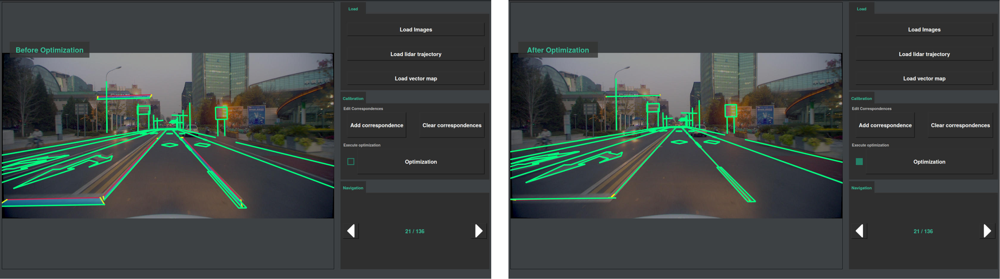

# Map-based Lidar-camera Calibration Tool

**Note: The whole project will be uploaded progressively, as some details in the project need to be improved and finalized.**

The software is an HD vector map based LiDAR-camera calibration tool, which could be used to calibrate non-overlapping LiDAR-camera pairs with little manually labeled correspondences, and inspect the quality of calibration results.   

  

The important features of the calibration tool:  
* LiDAR-camera calibration and inspection with HD vector map as the calibration field
* Recommend optimal selections of line-line 3d-2d correspondences and quick labeling
* Navigate between images with vector map reprojections and correspondences in a sequence

## Setup 

To run the software, you could  
1. Clone the repository to your workspace  
2. Install the dependencies  
    * System dependencies  
        - Qt5 
        - OpenCV > 3.4.0 
    * Python dependencies
        ```bash
        $ pip3 install numpy opencv-python PyQt5 pyquaternion
        ```
    * C++ Optimizer dependencies 
        - Eigen3
        - Ceres
        - Boost
        - jsoncpp
        - gflags
        - glog
3. Compile the C++ Optimizer
    ```bash
    cd ./calibration_tool/external/calibrate_lidar_camera_source/
    mkdir build
    cd build
    cmake ..
    make
    cp calibrate_lidar_camera ../../
    ```

## Usage

You could start the software by
```bash
cd ./calibration_tool
python3 main.py \
    --keyframes_dir ../test_data/sequence/keyframes \
    --vector_map_file_path ../test_data/sequence/map/map.json
```

## Contributing

Pull requests are welcome. For major changes, please open an issue first to discuss what you would like to change.

Please make sure to update tests as appropriate.

## License
[MIT](LICENSE)
